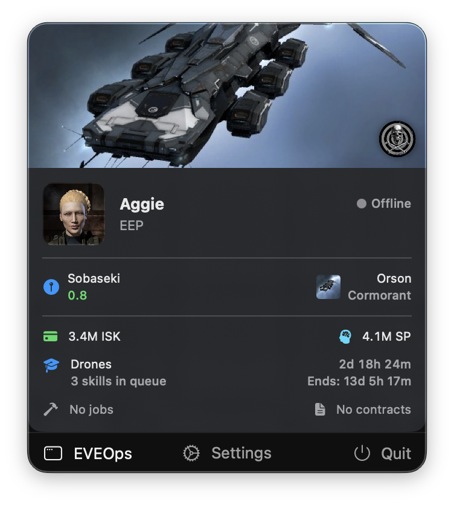
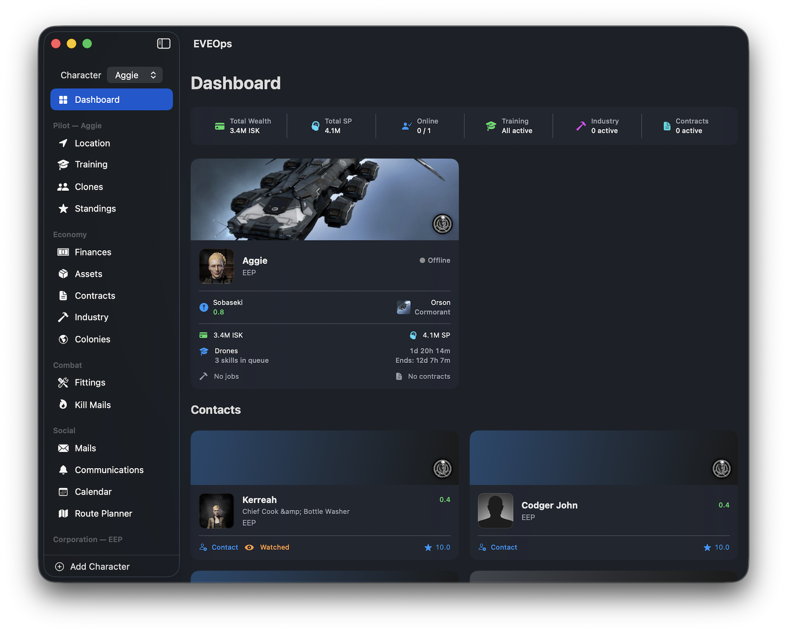

# EVEOps

A native macOS companion app for EVE Online — built in Swift and SwiftUI. Monitor all of your characters and corporation at a glance, right from your menu bar.

---

## Overview

EVEOps lives in your macOS menu bar and gives you instant visibility into every character and corporation you manage. No browser tabs. No alt-tabbing. Just the information you need, always one click away.

It connects to the official [EVE Swagger Interface (ESI)](https://esi.evetech.net) using EVE SSO with OAuth 2.0 + PKCE — your credentials never touch any third-party server.

---

## Screenshots

### Menu Bar — Quick Glance
> _See your active character's wallet, ship, location, skill queue, and more without opening the main window._



---

### Dashboard — All Characters at Once
> _A live overview of every character on your account: wealth, SP, online status, skill queues, industry jobs, contracts, and PI alerts._



---

### Training Overview
> _Track skill queues across all characters simultaneously. See what's training, when it finishes, and which characters have empty queues._


---

### Finances
> _Wallet balances, market orders, escrow, and net worth — aggregated across all characters, with per-character breakdowns and charts._


---

### Location & Ship
> _Know where each of your pilots is and what they're flying, including security status and system details._


---

### Assets
> _Browse character and corporation asset inventories, with type icons, quantities, and locations._


---

### Ships — Fittings
> _Ship fittings, High Slots, Medium Slots, Low Slots, Drone Bay._


---

## Features

### Multi-Character Support
- Add and manage multiple EVE characters from a single app
- Switch active character from the menu bar or sidebar
- Dashboard aggregates key stats across all characters simultaneously

### Menu Bar Integration
- Persistent menu bar icon for instant access
- Per-character summary: wallet, ship, location, skill queue, industry jobs, contracts, PI colony status
- Online/offline status indicator
- Quick-switch between characters without opening the main window

### Character Monitoring
| Section | What you see |
|---|---|
| **Dashboard** | Wealth, SP, online status, skill queue, jobs, contracts, PI alerts — all characters |
| **Location** | Current system, security status, ship name and type |
| **Training** | Active skill, queue length, finish times, empty queue warnings |
| **Finances** | Wallet balance, market orders, escrow, net worth charts |
| **Assets** | Full asset inventory with type icons and locations |
| **Clones** | Jump clones and implant sets |
| **Colonies** | PI colonies with extractor status and expiry alerts |
| **Contracts** | Outstanding and in-progress contracts |
| **Industry** | Active manufacturing and research jobs |
| **Mails** | EVE mail inbox |
| **Communications** | In-game notifications and alerts |

### Corporation Monitoring
| Section | What you see |
|---|---|
| **Assets** | Corporation-wide asset inventory |
| **Industry** | Active corporation manufacturing and research jobs |
| **Members** | Member roster |
| **Structures** | Deployed structures and their states |
| **Wallets** | Corporation divisional wallet balances |

### Smart Caching
- ESI response cache respects `Expires` headers — no unnecessary API calls
- Universe data (types, systems, regions, stations) persisted to disk with a 7-day TTL
- Name resolution cache persisted to disk across launches
- Dashboard data prefetched in the background on startup for instant display

### Background Monitoring & Notifications
- Background refresh keeps data current even when the window is closed
- Native macOS notifications for important events (skill queue empty, extractors offline, etc.)

### Security
- EVE SSO with OAuth 2.0 + PKCE — no passwords stored, ever
- Tokens stored securely in the macOS Keychain
- All communication goes directly to CCP's ESI — no middleman

---

## Requirements

- macOS 14 (Sonnet) or later
- An EVE Online account
- An [ESI application](https://developers.eveonline.com) with your client ID

---

## Setup

### 1. Register an ESI Application

1. Go to [developers.eveonline.com](https://developers.eveonline.com) and log in.
2. Create a new application.
3. Set the callback URL to `eveops://callback`.
4. Select the ESI scopes your characters need (see below).
5. Copy your **Client ID**.

### 2. Configure the Client ID

Open `EVEOps/Auth/SSOAuthenticator.swift` and replace the placeholder:

```swift
static let `default` = SSOConfiguration(
    clientID: "YOUR_CLIENT_ID",   // <-- paste your Client ID here
    ...
)
```

### 3. Build and Run

Open `EVEOps.xcodeproj` in Xcode 15 or later and build the `EVEOps` target.

---

## Required ESI Scopes

The following scopes are needed for full functionality:

```
esi-location.read_location.v1
esi-location.read_ship_type.v1
esi-location.read_online.v1
esi-skills.read_skills.v1
esi-skills.read_skillqueue.v1
esi-wallet.read_character_wallet.v1
esi-markets.read_character_orders.v1
esi-contracts.read_character_contracts.v1
esi-industry.read_character_jobs.v1
esi-planets.manage_planets.v1
esi-assets.read_assets.v1
esi-clones.read_clones.v1
esi-mail.read_mail.v1
esi-characters.read_notifications.v1
esi-corporations.read_corporation_membership.v1
esi-wallet.read_corporation_wallets.v1
esi-assets.read_corporation_assets.v1
esi-industry.read_corporation_jobs.v1
esi-corporations.read_structures.v1
esi-contracts.read_corporation_contracts.v1
```

Scopes can be omitted if you don't need the corresponding feature — EVEOps handles missing permissions gracefully.

---

## Architecture

EVEOps is built entirely with native Apple frameworks:

- **SwiftUI** — all views, including menu bar and main window
- **SwiftData** — persistent storage for accounts and cached names
- **Swift Concurrency** — `async`/`await` and actors throughout; no Combine
- **ASWebAuthenticationSession** — EVE SSO OAuth flow
- **Keychain** — secure token storage
- **Charts** — financial charts and visualizations

Key architectural patterns:
- `AccountManager` — `@MainActor @Observable`, manages all character state
- `ESIClient` — actor singleton, handles all ESI requests with response caching
- `UniverseCache` — actor singleton, persistent disk cache for static universe data
- `NameResolver` — actor singleton, persistent disk cache for entity name resolution
- `DashboardPrefetcher` — prefetches all dashboard data on startup so the UI is instant

---

## Contributing

Pull requests are welcome. For significant changes, please open an issue first to discuss what you'd like to change.

---

## Disclaimer

EVEOps is an unofficial third-party application and is not affiliated with or endorsed by CCP Games. EVE Online and all related trademarks are property of CCP hf.
